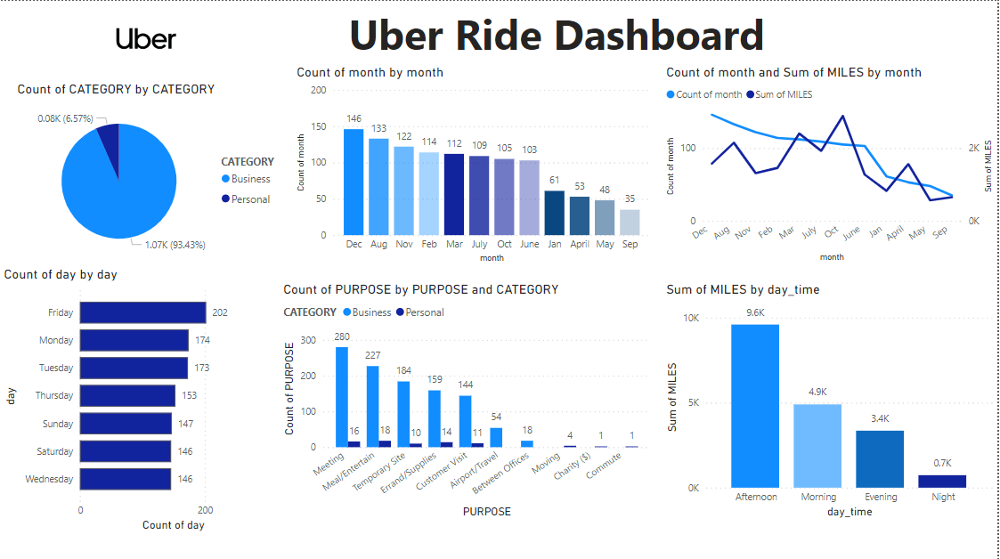

# 🚗 Uber Ride Data Analysis Project

<!-- Banner Image -->
<p align="center">
  
</p>

<div align="center">

  
  
  
  
  

</div>

<br/>

<div align="center">
  <strong>🚀 A comprehensive data analysis project exploring Uber ride patterns with interactive visualizations and actionable business insights</strong>
</div>

---

## 🌟 **Project Overview**

This comprehensive Uber Ride Data Analysis project provides deep insights into Uber's ride patterns through systematic data exploration, cleaning, and visualization. Built with modern data science tools and techniques, it offers detailed analysis of ride distributions, temporal patterns, and geographical trends to support data-driven decision making.

### 🎯 **Key Highlights**
- **📊 Comprehensive Data Analysis**: 12-step systematic approach to data exploration
- **🔍 Interactive Visualizations**: Multiple chart types including heatmaps, distribution plots, and trend analysis
- **🧹 Robust Data Cleaning**: Advanced preprocessing pipeline with missing value handling
- **📈 Business Intelligence**: Actionable insights and strategic recommendations
- **📱 Executive Dashboard**: Professional visualization dashboard for stakeholder presentations
- **🔧 Feature Engineering**: Advanced temporal and categorical feature extraction

---

## ✨ **Features**

### 🔧 **Technical Features**
- ✅ **Advanced Data Preprocessing** with Pandas and NumPy
- ✅ **Missing Value Handling** using forward fill and mode imputation
- ✅ **DateTime Processing** with comprehensive temporal feature extraction
- ✅ **Interactive Visualizations** powered by Matplotlib and Seaborn
- ✅ **Statistical Analysis** with correlation analysis and distribution plotting
- ✅ **Data Validation** and quality assurance throughout the pipeline
- ✅ **Automated Reporting** with exportable cleaned datasets

### 📈 **Dashboard Components**

#### 🎛️ **Analysis Categories**
- **Content Distribution**: Business vs Personal ride categorization
- **Temporal Patterns**: Monthly, daily, and hourly trend analysis
- **Purpose Analysis**: Trip purpose segmentation and insights
- **Geographic Insights**: Location-based ride distribution
- **Duration Analysis**: Trip duration patterns and optimization opportunities

#### 📊 **Visualization Suite**
1. **📈 Key Metrics Overview**: Total rides, categories, and summary statistics
2. **🍩 Category Distribution**: Interactive breakdown of business vs personal rides
3. **📅 Monthly Trends**: Seasonal patterns and ride frequency analysis
4. **🎭 Purpose Analysis**: Detailed trip purpose categorization
5. **🌍 Geographic Distribution**: Location-based ride patterns
6. **⏱️ Time-based Analysis**: Peak hours and usage patterns
7. **📊 Duration Insights**: Trip duration distributions and patterns
8. **🔥 Correlation Analysis**: Heatmap visualization of variable relationships

#### 💾 **Data Processing Pipeline**
- **Data Import**: CSV file loading and initial exploration
- **Quality Assessment**: Missing values, duplicates, and data type validation
- **Feature Engineering**: Temporal component extraction and calculated fields
- **Statistical Analysis**: Comprehensive descriptive statistics and correlations

---

## 📚 **Dataset Information**

### 📄 **Source Dataset**
- **File**: `UberDataset.csv`
- **Source**: Uber ride transaction data
- **Format**: CSV with comprehensive ride attributes
- **Processing**: Advanced cleaning and feature engineering pipeline

### 🗂️ **Data Schema**
```python
# Key Data Fields
START_DATE      # Trip start timestamp
END_DATE        # Trip end timestamp  
CATEGORY        # Business or Personal
START*          # Starting location coordinates
STOP*           # Ending location coordinates
MILES           # Distance traveled
PURPOSE         # Trip purpose/reason
```

### 📊 **Processed Features**
| Column | Description | Example |
|--------|-------------|---------|
| `CATEGORY` | Ride type classification | Business, Personal |
| `PURPOSE` | Trip purpose | Meeting, Airport, Meal/Entertain |
| `MILES` | Distance traveled | 5.2, 12.8, 3.1 |
| `start_date` | Extracted start date | 2016-01-01 |
| `start_time` | Extracted start time | 14:30:00 |
| `month` | Trip month | 1, 2, 3, ..., 12 |
| `year` | Trip year | 2016, 2017, 2018 |
| `start_hour` | Trip start hour | 8, 14, 20 |
| `duration_minutes` | Trip duration | 25, 45, 60 |

---

## 📁 **Project Structure**

```
Uber-Rides-Data-Analysis/
├── 📁 data/
│   ├── 📄 UberDataset.csv                    # Original dataset
│   └── 📄 UberDatasetCleaned.csv             # Processed dataset
├── 📁 notebooks/
│   └── 📄 Uber_Rides_Data_Analysis.ipynb     # Main analysis notebook
├── 📁 visualizations/
│   ├── 📄 Dashboard.png                      # Executive dashboard
│   ├── 📄 banner.png                         # Project banner
│   └── 📄 csv.png                            # Dataset preview
├── 📁 documentation/
│   └── 📄 Analysis_Documentation.docx        # Detailed documentation
├── 📄 requirements.txt                       # Python dependencies
├── 📄 README.md                              # This file
└── 📄 .gitignore                             # Git ignore rules
```

---

## 🚀 **Installation & Setup**

### 📋 **Prerequisites**
- Python 3.8 or higher
- Jupyter Notebook or JupyterLab
- pip (Python package manager)
- Git (for cloning the repository)

### 🔧 **Step 1: Clone the Repository**
```bash
git clone https://github.com/Geo-y20/Uber-Rides-Data-Analysis.git
cd Uber-Rides-Data-Analysis
```

### 🐍 **Step 2: Create Virtual Environment**
```bash
# Create virtual environment
python -m venv uber_env

# Activate virtual environment
# On Windows:
uber_env\Scripts\activate
# On macOS/Linux:
source uber_env/bin/activate
```

### 📦 **Step 3: Install Dependencies**
```bash
pip install -r requirements.txt
```

### ▶️ **Step 4: Run the Analysis**
```bash
# Launch Jupyter Notebook
jupyter notebook

# Open the main analysis file
# Navigate to: notebooks/Uber_Rides_Data_Analysis.ipynb
```

The analysis will be available in your browser at `http://localhost:8888`

---

## 🖥️ **Usage Guide**

### 🎯 **Getting Started**
1. **Launch Jupyter**: Open the notebook environment
2. **Load the Dataset**: Run the data import cells
3. **Explore Analysis**: Follow the step-by-step analysis process
4. **View Visualizations**: Interactive charts and plots throughout the notebook
5. **Review Insights**: Examine findings and recommendations

### 📊 **Analysis Workflow**

#### 🔍 **Data Exploration Phase**
- **Dataset Loading**: Import and initial inspection
- **Structure Analysis**: Data types, dimensions, and basic statistics
- **Quality Assessment**: Missing values, duplicates, and data integrity
- **Initial Insights**: Preliminary patterns and observations

#### 🧹 **Data Cleaning Phase**
- **Missing Value Treatment**: Forward fill and mode imputation strategies
- **DateTime Conversion**: Proper timestamp formatting and validation
- **Feature Engineering**: Temporal component extraction and calculated fields
- **Data Validation**: Quality assurance and consistency checks

#### 📈 **Analysis Phase**
- **Descriptive Statistics**: Comprehensive statistical summaries
- **Categorical Analysis**: Category distributions and patterns
- **Temporal Analysis**: Time-based trends and seasonality
- **Correlation Analysis**: Variable relationships and dependencies

#### 📊 **Visualization Phase**
- **Distribution Plots**: Data distributions and patterns
- **Trend Analysis**: Time-series visualizations
- **Categorical Plots**: Category-based comparisons
- **Heatmaps**: Correlation and pattern visualization

### 🔥 **Key Analysis Features**

#### 📊 **Interactive Visualizations**
- **Matplotlib Integration**: High-quality static plots
- **Seaborn Enhancement**: Statistical visualization improvements
- **Custom Styling**: Professional chart formatting
- **Export Options**: Save visualizations for presentations

#### 🎛️ **Data Processing Pipeline**
- **Automated Cleaning**: Systematic data preprocessing
- **Feature Engineering**: Advanced feature creation
- **Quality Assurance**: Data validation and verification
- **Export Functionality**: Save processed datasets

---

## 🛠️ **Technical Implementation**

### 🏗️ **Architecture Overview**
```
┌─────────────────┐    ┌─────────────────┐    ┌─────────────────┐
│   Data Input    │    │   Processing     │    │   Analysis      │
│   (CSV Files)   │───►│   Pipeline       │───►│   & Insights    │
│                 │    │   (Pandas/NumPy) │    │                 │
└─────────────────┘    └─────────────────┘    └─────────────────┘
         │                       │                       │
         ▼                       ▼                       ▼
┌─────────────────┐    ┌─────────────────┐    ┌─────────────────┐
│   Raw Dataset   │    │   Cleaned Data   │    │   Visualizations│
│   Validation    │    │   Feature Eng.   │    │   & Reports     │
└─────────────────┘    └─────────────────┘    └─────────────────┘
```

### 🔧 **Technology Stack**

#### 🐍 **Core Libraries**
- **Pandas**: Data manipulation and analysis
- **NumPy**: Numerical computing and arrays
- **Matplotlib**: Comprehensive plotting library
- **Seaborn**: Statistical data visualization

#### 📊 **Analysis Tools**
- **Jupyter**: Interactive development environment
- **IPython**: Enhanced interactive Python
- **DateTime**: Advanced date/time processing
- **Statistics**: Built-in statistical functions

#### 🔐 **Best Practices**
- **Data Validation**: Comprehensive quality checks
- **Error Handling**: Robust exception management
- **Documentation**: Inline comments and markdown
- **Version Control**: Git-based project management

### 📊 **Performance Optimizations**
- **Vectorized Operations**: Efficient Pandas operations
- **Memory Management**: Optimized data types
- **Lazy Evaluation**: On-demand processing
- **Caching**: Intermediate result storage

---

## 📱 **Screenshots & Visualizations**

### 🏠 **Executive Dashboard**
<p align="center">
  
</p>

### 📊 **Dataset Preview**
<p align="center">
  
</p>

### 📈 **Analysis Results**
The dashboard showcases comprehensive insights including:
- **Category Distribution**: Business vs Personal ride breakdown
- **Monthly Patterns**: Seasonal trends and peak periods
- **Purpose Analysis**: Trip purpose segmentation
- **Geographic Insights**: Location-based patterns
- **Temporal Analysis**: Hour, day, and monthly trends
- **Duration Insights**: Trip duration distributions

---

## 🧪 **Analysis Results & Insights**

### 📊 **Key Findings**

#### 🎯 **Category Distribution**
- **Business Rides**: Professional and work-related transportation
- **Personal Rides**: Leisure and personal transportation needs
- **Usage Patterns**: Distinct patterns between categories

#### 📅 **Temporal Insights**
- **Monthly Trends**: Seasonal variations in ride frequency
- **Daily Patterns**: Weekday vs weekend usage differences
- **Hourly Distribution**: Peak and off-peak hour identification

#### 🌍 **Geographic Patterns**
- **Location Analysis**: High-demand areas and routes
- **Distance Trends**: Short vs long-distance trip patterns
- **Regional Preferences**: Area-specific usage characteristics

### 💡 **Strategic Recommendations**

#### 🎯 **Operational Optimization**
1. **Peak Hour Management**: Optimize driver allocation during high-demand periods
2. **Seasonal Adjustments**: Prepare for monthly and seasonal variations
3. **Category-Specific Services**: Tailor offerings for business vs personal users
4. **Geographic Focus**: Concentrate resources in high-demand areas

#### 📈 **Business Strategy**
5. **Purpose-Based Marketing**: Target campaigns by trip purpose
6. **Dynamic Pricing**: Implement time-based pricing strategies
7. **Service Expansion**: Focus on underserved high-potential areas
8. **Customer Segmentation**: Develop category-specific features

#### 🔧 **Service Improvements**
9. **Duration Optimization**: Reduce trip times through route optimization
10. **Feedback Integration**: Implement systematic customer feedback collection

---

## 🔧 **Troubleshooting**

### 🚨 **Common Issues**

#### 📦 **Package Installation Issues**
```bash
# Upgrade pip
pip install --upgrade pip

# Install specific versions
pip install pandas==1.3.0 matplotlib==3.4.0

# Clear cache
pip cache purge
```

#### 🔍 **Data Loading Issues**
```python
# Check file path
import os
print(os.getcwd())

# Verify file exists
if os.path.exists('UberDataset.csv'):
    print("File found")
else:
    print("File not found")
```

#### 📊 **Visualization Issues**
```python
# Enable inline plotting
%matplotlib inline

# Clear matplotlib cache
import matplotlib.pyplot as plt
plt.rcdefaults()
```

### 🐛 **Debug Mode**
```python
# Enable verbose pandas operations
import pandas as pd
pd.set_option('display.max_columns', None)
pd.set_option('display.width', None)
```

---

## 🚀 **Future Enhancements**

### 🔮 **Planned Features**
- [ ] **🤖 Machine Learning Integration**: Predictive models for ride demand
- [ ] **📱 Interactive Dashboard**: Web-based Streamlit dashboard
- [ ] **🔔 Real-time Analysis**: Live data processing capabilities
- [ ] **🌍 Geographic Mapping**: Interactive maps with ride patterns
- [ ] **📊 Advanced Analytics**: Statistical modeling and forecasting
- [ ] **🎨 Enhanced Visualizations**: 3D plots and animated charts
- [ ] **📤 Automated Reporting**: Scheduled report generation
- [ ] **🔗 API Integration**: External data source connectivity

### 🛠️ **Technical Improvements**
- [ ] **⚡ Performance Optimization**: Faster data processing
- [ ] **🔄 Pipeline Automation**: Automated data processing workflows
- [ ] **🧪 Testing Framework**: Comprehensive test suite
- [ ] **📈 Monitoring**: Data quality monitoring and alerts
- [ ] **🔐 Security Enhancement**: Data privacy and security measures
- [ ] **🌍 Scalability**: Support for larger datasets

---

## 🤝 **Contributing**

### 🛠️ **Development Setup**
```bash
# Fork the repository
git clone https://github.com/Geo-y20/Uber-Rides-Data-Analysis.git

# Create feature branch
git checkout -b feature/your-feature-name

# Install development dependencies
pip install -r requirements.txt

# Run analysis
jupyter notebook
```

### 📝 **Contribution Guidelines**
1. **🔍 Code Review**: All PRs require review
2. **✅ Testing**: Validate analysis results
3. **📖 Documentation**: Update docs for new features
4. **🎨 Style**: Follow PEP 8 style guidelines
5. **🔒 Data Privacy**: Ensure data protection compliance

### 🐛 **Bug Reports**
Please use the GitHub issue tracker for bug reports:
- **📋 Template**: Use the provided issue template
- **🔍 Details**: Include steps to reproduce
- **📊 Environment**: Specify OS, Python version, etc.
- **📸 Screenshots**: Include relevant screenshots

---

## 📜 **License**

This project is licensed under the MIT License - see the [LICENSE](LICENSE) file for details.

```
MIT License

Copyright (c) 2024 Uber Ride Data Analysis Project

Permission is hereby granted, free of charge, to any person obtaining a copy
of this software and associated documentation files (the "Software"), to deal
in the Software without restriction, including without limitation the rights
to use, copy, modify, merge, publish, distribute, sublicense, and/or sell
copies of the Software, and to permit persons to whom the Software is
furnished to do so, subject to the following conditions:

The above copyright notice and this permission notice shall be included in all
copies or substantial portions of the Software.
```

---

## 🙏 **Acknowledgments**

### 📊 **Data Sources**
- **Uber**: Transportation and ride-sharing data
- **Public Datasets**: Open data initiatives
- **Data Science Community**: Best practices and methodologies

### 🛠️ **Libraries & Tools**
- **Pandas Team**: Powerful data manipulation library
- **Matplotlib**: Comprehensive plotting capabilities
- **Seaborn**: Statistical visualization excellence
- **Jupyter**: Interactive development environment

### 🌟 **Inspiration**
- **Data Science Best Practices**: Industry standards and methodologies
- **Transportation Analytics**: Modern mobility insights
- **Business Intelligence**: Data-driven decision making principles

---

## 📞 **Contact & Support**

### 👤 **Author**
- **Name**: Sentamilmukilan.R.M
- **Email**: sentamilmukilan@example.com
- **GitHub**: [@Geo-y20](https://github.com/Geo-y20)
- **LinkedIn**: [Sentamilmukilan R M](https://linkedin.com/in/sentamilmukilan)

### 💬 **Support Channels**
- **🐛 Bug Reports**: [GitHub Issues](https://github.com/Geo-y20/Uber-Rides-Data-Analysis/issues)
- **💡 Feature Requests**: [GitHub Discussions](https://github.com/Geo-y20/Uber-Rides-Data-Analysis/discussions)
- **❓ Questions**: [Stack Overflow](https://stackoverflow.com/questions/tagged/uber-data-analysis)
- **📧 Email**: support@uberanalysis.com

### 🌟 **Show Your Support**
If you found this project helpful, please consider:
- ⭐ **Starring** the repository
- 🍴 **Forking** for your own modifications
- 📢 **Sharing** with your network
- 🐛 **Reporting** issues and bugs
- 💡 **Suggesting** new features

---

<div align="center">
  <h3>🚗 Built with ❤️ for data enthusiasts and transportation analytics</h3>
  <p>© 2024 Uber Ride Data Analysis Project. All rights reserved.</p>
</div>

---

*Last updated: July 2024*
